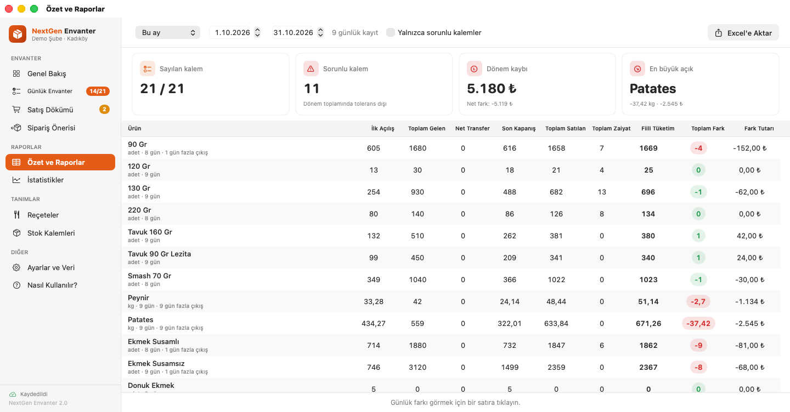
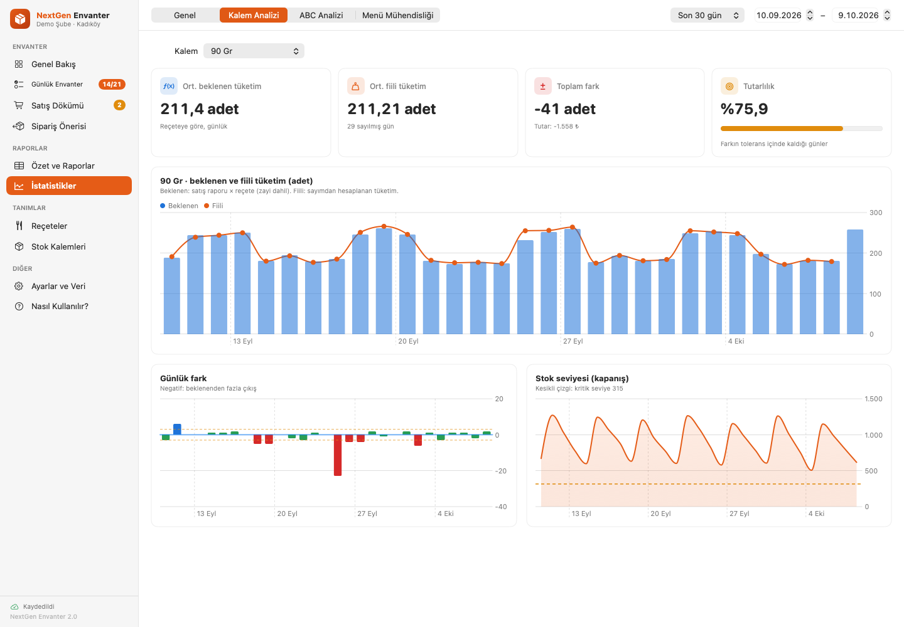
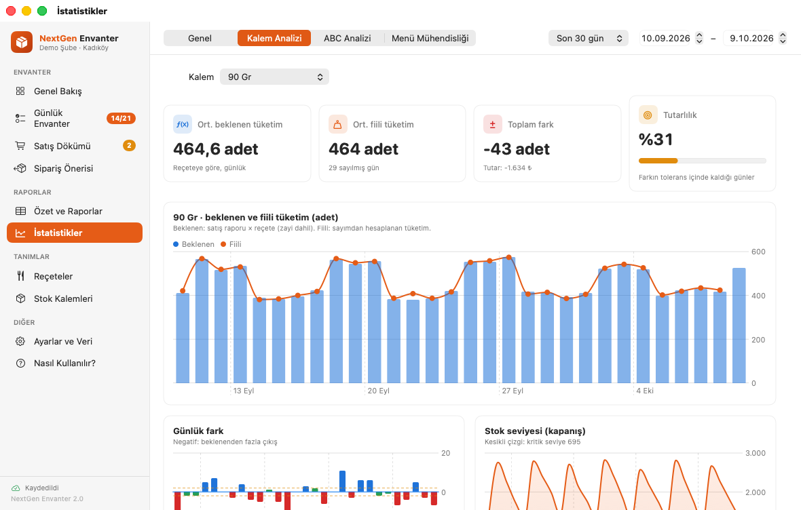
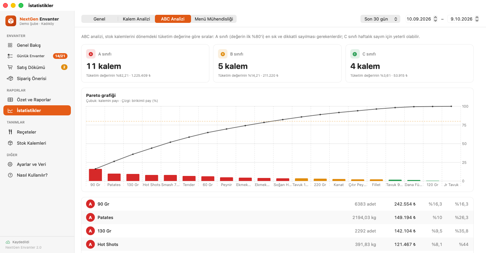
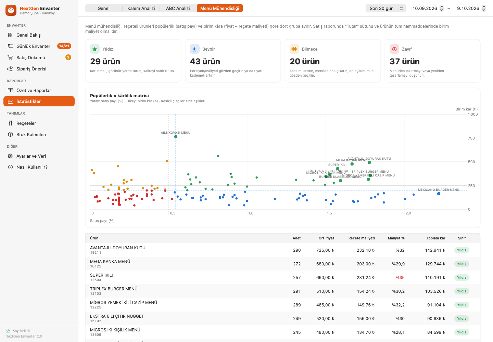
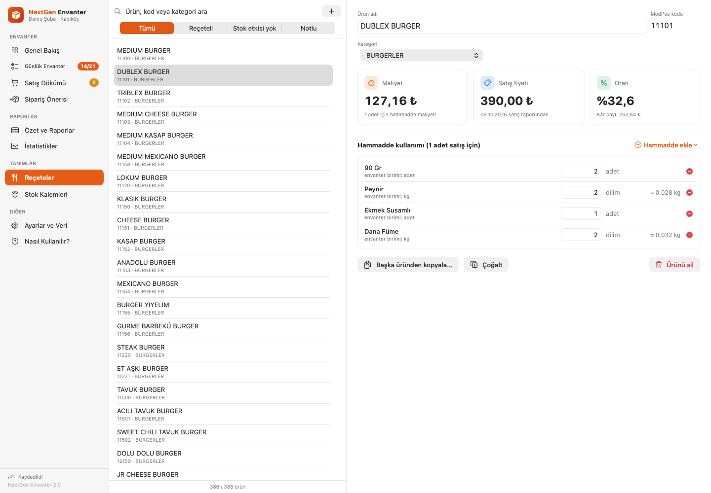
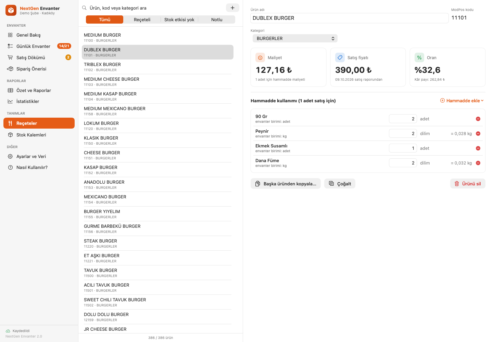
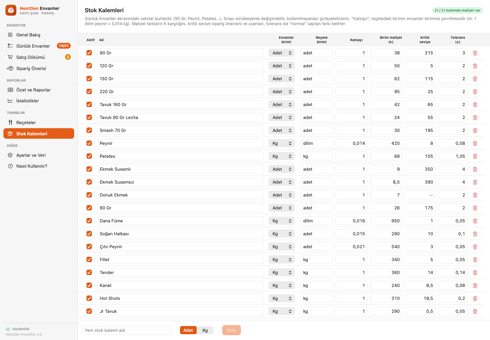
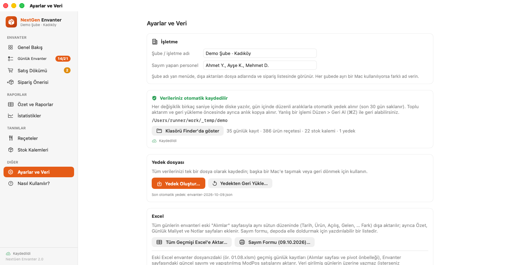

# NextGen Envanter

Restoranlar için macOS stok, fire ve maliyet takip uygulaması. Excel'deki envanter dosyasının (Envanter, KOD, Alımlar, Özet sayfaları ve makroları) yaptığı işi otomatik yapar; ModPos satış raporunu reçetelerle hammaddeye çevirir, günlük sayımla karşılaştırır ve farkı **₺ olarak** gösterir. Şirket içi kullanım içindir (App Store'da yayınlanmaz).


## Özellikler

| Ekran | Ne işe yarar |
| --- | --- |
| **Genel Bakış** | Seçili günün sayım ilerlemesi, satış raporu durumu, sorunlu kalem sayısı ve günün kaybı (₺); son 14 günün kayıp grafiği; tolerans dışı farklar, kritik seviyenin altındaki stoklar ve reçetesi tanımsız satışlar; hızlı işlemler. |
| **Günlük Envanter** | Açılış (önceki günden otomatik), Gelen, Transfer, Kapanış girişi; Satılan/Zaiyat reçeteden otomatik; Fiili Tüketim ve Fark. Tolerans ve kritik seviyeye göre renkler, ₺ fark, *Sayılmayan / Sorunlu* filtresi, gün notu ve sayımı yapan kişi, **günü kapatma kilidi**, hareketsiz kalemleri tek tıkla doldurma, satır bazında hesap dökümü. |
| **Satış Dökümü** | ModPos satırlarının reçeteli / stok etkisi yok / reçete tanımsız ayrımı, her satırın stoktan düşürdüğü miktarlar, tek tıkla reçete tanımlama. |
| **Sipariş Önerisi** | Son 7/14/30 günün ortalama tüketimi × istenen gün + kritik seviye − son stok. Listeyi tedarikçiye WhatsApp'tan göndermek için kopyalama veya Excel. |
| **Özet ve Raporlar** | Dönem toplamları (İlk açılış, gelen, net transfer, satılan, zaiyat, fiili tüketim, fark, ₺), KPI kartları, kalem bazında günlük fark grafiği (tolerans bandıyla). |
| **İstatistikler** | *Genel:* satış tutarı, teorik/fiili maliyet ve **food cost %**, kayıp, zayi, alım tutarı, stok değeri; maliyet yüzdesi eğilimi, en çok kayıp veren kalemler, zayi dağılımı, sayım düzeni. *Kalem Analizi:* beklenen ve fiili tüketim, günlük fark, stok seviyesi. *ABC Analizi:* Pareto grafiği ve A/B/C sınıfları. *Menü Mühendisliği:* popülerlik × kârlılık matrisi (Yıldız, Beygir, Bilmece, Zayıf) ve ürün bazında maliyet oranı. |
| **Reçeteler** | 386 hazır reçete; hammadde ekleme/çıkarma, başka üründen kopyalama, **reçete maliyeti**, ortalama satış fiyatı ve maliyet oranı. |
| **Stok Kalemleri** | Birim, reçete birimi ve katsayı; **birim maliyet (₺)**, **kritik seviye**, **tolerans (±)**; sıralama ve gizleme. |
| **Ayarlar ve Veri** | Şube adı, personel listesi, otomatik kayıt ve yedekler, yedek dosyası, Excel'e aktarım, **sayım formu**, eski Excel dosyasından içe aktarım. |

Diğer:
- **Geri al / Yinele** (⌘Z / ⇧⌘Z) tüm veri değişikliklerinde.
- Otomatik kayıt (kayıt durumu yan menüde), günlük yedekler (son 30 gün), riskli işlemlerden önce anlık kopya, bozuk dosyada yedekten otomatik dönüş.
- Satış raporu `.xlsx`, `.csv`, `.txt` (UTF-8, UTF-16, Windows-1254) veya panodan; pencereye sürükle-bırak. Raporda **Tutar** sütunu varsa maliyet yüzdeleri ve menü analizi hesaplanır.
- Excel'e aktarım eski *Alımlar* sayfasıyla aynı sütun düzenindedir (pivot tablolar çalışmaya devam eder) + Özet, Günlük Maliyet, Notlar sayfaları.

### Kısayollar

| Kısayol | İşlem |
| --- | --- |
| ⌘O / ⌘⇧V | Satış raporu aktar / panodan yapıştır |
| ⌘E | Günü Excel'e aktar |
| ⌘[ / ⌘] / ⌘T | Önceki gün / sonraki gün / bugün |
| ⌘L | Günü kapat / kilidi aç |
| ⌘1 … ⌘9 | Ekranlar arasında geçiş |
| ⌘Z / ⇧⌘Z | Geri al / yinele |

## Ekran görüntüleri

Görüntüler CI'da, uygulamanın `EnvanterTool demo` ile üretilen örnek veriyle çalıştırılmasıyla otomatik alınır.

| | |
| --- | --- |
|  **Günlük Envanter** |  **Satış Dökümü** |
|  **Özet ve Raporlar** |  **İstatistikler · Genel** |
|  **İstatistikler · Kalem Analizi** |  **İstatistikler · ABC Analizi** |
|  **İstatistikler · Menü Mühendisliği** |  **Sipariş Önerisi** |
|  **Reçeteler** |  **Stok Kalemleri** |
|  **Ayarlar ve Veri** | |

## Kurulum (şirket içi)

1. Bir Mac'te (macOS 14+, Xcode 15+ veya Swift 5.9+ araç zinciri) derleyin:
   ```bash
   ./Scripts/build_app.sh          # build/NextGen Envanter.app + build/NextGen-Envanter-2.0.zip
   ./Scripts/build_app.sh --dmg    # ayrıca .dmg
   ```
   Hazır paket, GitHub Actions'taki her başarılı çalışmanın **NextGen-Envanter** artifact'ında da bulunur.
2. `.zip`'i diğer Mac'lere kopyalayın, `NextGen Envanter.app`'i *Uygulamalar* klasörüne taşıyın.
3. Uygulama ad-hoc imzalıdır. İlk açılışta macOS uyarı verirse Finder'da uygulamaya sağ tıklayıp **Aç** deyin ya da:
   ```bash
   xattr -dr com.apple.quarantine "/Applications/NextGen Envanter.app"
   ```

Veriler `~/Library/Application Support/Envanter/` altında tutulur (`envanter-verisi.json` ve `Yedekler/`). Uygulamayı silmek veya güncellemek verilere dokunmaz. Başka bir klasör kullanmak için `ENVANTER_DATA_DIR` ortam değişkeni verilebilir.

## Komut satırı aracı

Paketin içinde `Contents/MacOS/EnvanterTool` olarak gelir (uygulama kapalıyken kullanın):

```bash
EnvanterTool status                                      # veri özeti
EnvanterTool import-excel 01.08.xlsm [--overwrite] [--dry-run]
EnvanterTool export-excel rapor.xlsx [--from 01.08.2026] [--to 31.08.2026]
EnvanterTool orders [--date 09.10.2026] [--days 14] [--cover 3]   # sipariş listesi (metin)
EnvanterTool demo --data-dir ~/Desktop/demo [--days 35]           # eğitim için örnek veri
```

Demo veriyle uygulamayı açmak (gerçek veriye dokunmaz):

```bash
ENVANTER_DATA_DIR=~/Desktop/demo "/Applications/NextGen Envanter.app/Contents/MacOS/Envanter"
```

## Hesaplama

- **Fiili Tüketim** = Açılış + Gelen + Gelen Transfer − (Giden Transfer + Kapanış)
- **Fark** = (Satılan + Zaiyat) − Fiili Tüketim → negatif: satışlara göre fazla stok çıkmış (kayıp)
- **Teorik maliyet** = reçeteye göre tüketim × birim maliyet; **fiili maliyet** = teorik maliyet − sayılan kalemlerdeki net farkın tutarı
- **Food cost %** = maliyet / satış tutarı
- **Sipariş önerisi** = ortalama günlük tüketim × gün + kritik seviye − son sayılan stok (adet yukarı tam sayıya, kg 0,1'e yuvarlanır)
- **ABC**: tüketim değerinin ilk %80'i A, sonraki %15'i B, kalanı C
- **Menü mühendisliği** (Kasavana & Smith): popülerlik eşiği beklenen payın %70'i, kârlılık eşiği ağırlıklı ortalama birim kâr

## Geliştirme

```
Sources/EnvanterCore   Platformdan bağımsız iş mantığı (motor, istatistik, Excel/ZIP okuma-yazma, kayıt)
Sources/Envanter       SwiftUI uygulaması (yalnızca macOS)
Sources/EnvanterTool   Komut satırı aracı
Tests/EnvanterCoreTests
```

```bash
swift test        # macOS veya Linux (çekirdek testleri)
swift build       # macOS'ta uygulama dahil
```

CI (`.github/workflows/ci.yml`): Linux'ta çekirdek testleri; macOS'ta uygulamanın derlenmesi, testler, dağıtım paketi ve demo veriyle ekran görüntüleri.

## Yol haritası / öneriler

- **Çok şubeli kullanım:** Her şubenin verisini merkezde birleştiren (ör. ortak bir sunucu ya da paylaşılan klasöre günlük JSON aktarımı) bir şube karşılaştırma ekranı.
- **ModPos entegrasyonu:** Raporu elle almak yerine ModPos'un dışa aktarım klasörünü izleyip her sabah otomatik içe aktarma.
- **Tedarikçi ve fatura kaydı:** Gelen mallar için tedarikçi, fatura no ve birim fiyat; maliyetlerin son alış fiyatından otomatik güncellenmesi (FIFO / ağırlıklı ortalama).
- **iPad / iPhone ile sayım:** Depoda telefonla (barkod/QR ile) sayım yapıp Mac'e aktarma.
- **Yetkilendirme:** Gün kilidini yalnızca yöneticinin açabilmesi için basit PIN; kim neyi değiştirdi kaydı (denetim günlüğü).
- **Bildirimler:** Kritik seviyenin altına düşen kalemler ve yüksek kayıp günleri için günlük e-posta/WhatsApp özeti (`EnvanterTool orders` bir cron/launchd göreviyle bugün de kullanılabilir).
- **Bütçe hedefleri:** Food cost % hedefi (ör. %30) ve hedef aşımında uyarı; hafta/ay karşılaştırmaları.
- **Yarı mamul reçeteleri:** Soslar ve hazırlıklar için alt reçeteler (reçete içinde reçete).
- **Kod imzalama:** Şirket bir Apple Developer hesabı alırsa uygulama Developer ID ile imzalanıp noter onayından (notarization) geçirilerek Gatekeeper uyarısı tamamen kaldırılabilir.
