# NextGen Envanter

Restoranlar için macOS stok, fire, maliyet ve personel maliyeti takip uygulaması. Excel'deki envanter dosyasının (Envanter, KOD, Alımlar, Özet sayfaları ve makroları) yaptığı işi otomatik yapar. ModPos satış raporunu reçetelerle hammaddeye çevirir, günlük sayımla karşılaştırır ve farkı **₺ olarak** gösterir. Bunlara ek olarak **food cost %**, **personel %** ve **prime cost** hedeflerini izler. Şirket içi kullanım içindir (App Store'da yayınlanmaz).

> Ekran görüntülerindeki rakamlar `EnvanterTool demo` ile üretilmiş **örnek verilerdir** ("Burger Yiyelim · Tuzla Marina" demo şubesi). Gerçek satış veya maliyet verisi değildir.

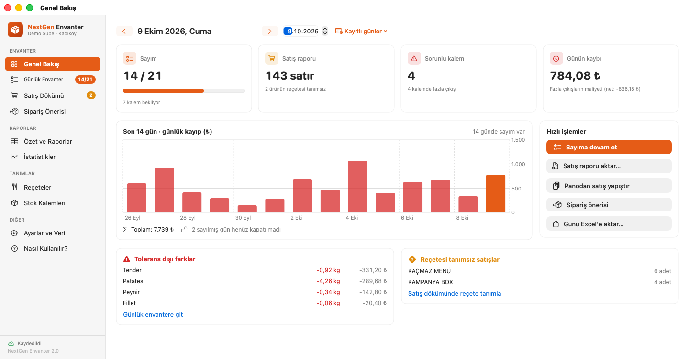

## Özellikler

| Ekran | Ne işe yarar |
| --- | --- |
| **Genel Bakış** | Seçili günün sayım ilerlemesi, satış raporu durumu, sorunlu kalem sayısı ve günün kaybı (₺). Ay kartlarında food cost %, personel % ve prime cost hedef çubuklarıyla görünür. Son 30 günün sayım düzeni (tracker; kırmızı = kayıp satışın %1'ini aştı) ve son 14 günün kayıp grafiği yer alır. *Dikkat* listeleri: tolerans dışı farklar, **fiyat artışları**, kritik seviyenin altındaki stoklar, açık siparişler ve reçetesi tanımsız satışlar. Hızlı işlemler. |
| **Günlük Envanter** | Açılış (önceki günden otomatik), Gelen, Transfer, Kapanış girişi. Satılan/Zayi reçeteden otomatik gelir; Fiili Tüketim ve Fark hesaplanır. Tolerans ve kritik seviyeye göre renkler, ₺ fark ve *Sayılmayan / Sorunlu* filtresi vardır. Ayrıca gün notu, sayımı yapan kişi, **günü kapatma kilidi**, hareketsiz kalemleri tek tıkla doldurma ve satır bazında hesap dökümü. |
| **Satış Dökümü** | ModPos satırlarını *reçeteli / stok etkisi yok / reçete tanımsız* olarak ayırır. Her satırın stoktan düşürdüğü miktarlar görünür; reçete tek tıkla tanımlanır. |
| **Sipariş Önerisi** | Öneri = son 7/14/30 günün ortalama tüketimi × istenen gün + kritik seviye − mevcut stok − **siparişte bekleyen**. Mevcut stok, son sayıma sonraki günlerin gelen/transfer ve satışları eklenerek tahmin edilir; böylece aynı mal iki kez sipariş edilmez. Öneriden **satın alma siparişi** oluşturulur; teslim alınınca miktarlar o günün *Gelen* sütununa, fatura birim fiyatı tarihli fiyat geçmişine ve birim maliyete işlenir (geçmiş tarihli fatura daha yeni fiyatı ezmez). Liste WhatsApp için kopyalanabilir veya Excel'e aktarılabilir. |
| **Personel** | Personel listesi (aylık maaş / yevmiye / saatlik, işveren çarpanı, düzenlenebilir giriş-çıkış tarihi, **tarihli ücret geçmişi**: zam önceki günleri değiştirmez). Günlük vardiya tablosunda saat, çalıştı işareti ve ek ödeme girilir; *varsayılan vardiyaları doldur* tek tıktır. Ayrıca günlük diğer personel giderleri, aylık personel maliyeti grafiği, kişi bazında döküm, **personel %** ve **prime cost %**. |
| **Özet ve Raporlar** | Dönem toplamları (ilk açılış, gelen, net transfer, satılan, zayi, fiili tüketim, fark, ₺) ve KPI kartları. Kalem bazında günlük fark grafiği tolerans bandıyla gösterilir. |
| **İstatistikler** | *Genel:* satış tutarı, teorik/fiili maliyet, **food cost %**, personel %, prime cost, kayıp, zayi, alım tutarı, stok değeri; maliyet dağılımı, hedef çizgili eğilim grafikleri ve en çok kayıp veren kalemler. *Kalem Analizi:* beklenen ve fiili tüketim, günlük fark, stok seviyesi ve **birim maliyet geçmişi**. *ABC Analizi:* Pareto grafiği ve A/B/C sınıfları. *Menü Mühendisliği:* popülerlik × kârlılık matrisi (Yıldız, Beygir, Bilmece, Zayıf) ve ürün bazında maliyet oranı. |
| **Reçeteler** | 386 hazır reçete; hammadde ekleme/çıkarma, başka üründen kopyalama, **reçete maliyeti**, ortalama satış fiyatı ve maliyet oranı. |
| **Stok Kalemleri** | Birim, reçete birimi ve katsayı; **birim maliyet (₺)** ve son fiyat değişimi, **kritik seviye**, **tolerans (± adet/kg)**; sıralama ve gizleme. |
| **Ayarlar ve Veri** | Şube adı, sayım yapan personel listesi, **hedefler** (food cost %, personel %, prime cost %, fiyat artışı uyarı eşiği). Ayrıca otomatik kayıt ve yedekler, yedek dosyası, Excel'e aktarım, **sayım formu** ve eski Excel dosyasından içe aktarım. |
| **Nasıl Kullanılır?** | Adım adım günlük iş akışı, **notlar ve ipuçları**, Excel'den farklar, kısayollar ve aranabilir **terimler sözlüğü**. |

Diğer:
- **Terim açıklamaları:** ABC analizi, teorik/fiili maliyet, prime cost, tolerans gibi terimlerin yanındaki ⓘ işaretinin üzerine gelince kısa açıklama çıkar, tıklayınca ayrıntılı açıklama açılır. Tablo başlıkları da aynı şekilde açıklamalıdır.
- **Liquid Glass tasarım:** macOS 26'da Apple'ın yerel Liquid Glass yüzeyleri (cam kartlar, cam düğmeler, yüzen cam yan menü); macOS 14–15'te aynı yüzeyler buzlu cam malzemesiyle çizilir.
- **Geri al / Yinele** (⌘Z / ⇧⌘Z) tüm veri değişikliklerinde çalışır.
- **Kayıt ve yedek:** Otomatik kayıt yapılır, kayıt durumu yan menüde görünür. Günlük yedekler son 30 günü kapsar ve riskli işlemlerden önce anlık kopya alınır. Dosya bozulursa en son yedekten otomatik dönülür; o da okunamazsa bozuk dosya kenara alınır, üzerine yazılmaz.
- **Satış raporu:** `.xlsx`, `.csv` ve `.txt` (UTF-8, UTF-16, Windows-1254) dosyaları ya da pano kabul edilir; dosya hangi ekranda olursa olsun pencereye sürüklenip bırakılabilir. Raporda **Tutar** sütunu varsa maliyet yüzdeleri ve menü analizi hesaplanır.
- **Excel'e aktarım:** Eski *Alımlar* sayfasıyla aynı sütun düzeni kullanılır (pivot tablolar çalışmaya devam eder). Ek olarak Özet, Günlük Maliyet (personel ve prime cost dahil, dönem toplamı satırıyla), Notlar ve Personel sayfaları yazılır. Eski Excel dosyasından aktarım, günlerin vardiya/not/kilit bilgisine dokunmaz.

### Kısayollar

| Kısayol | İşlem |
| --- | --- |
| ⌘O / ⌘⇧V | Satış raporu aktar / panodan yapıştır |
| ⌘E | Günü Excel'e aktar |
| ⌘[ / ⌘] / ⌘T | Önceki gün / sonraki gün / bugün |
| ⌘L | Günü kapat / kilidi aç |
| ⌘1 … ⌘9 | Ekranlar arasında geçiş |
| ⌘, | Ayarlar ve Veri |
| ⌘Z / ⇧⌘Z | Geri al / yinele |

## Ekran görüntüleri

Görüntüler CI'da, uygulama `EnvanterTool demo` ile üretilen örnek veriyle çalıştırılarak otomatik alınır.

| | |
| --- | --- |
| 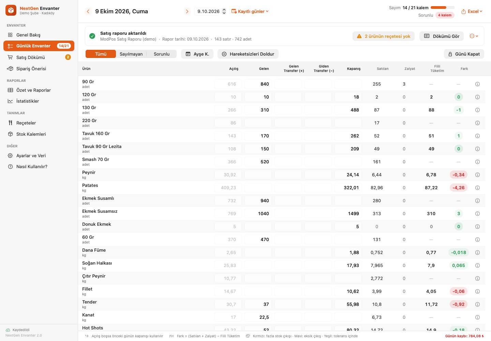 **Günlük Envanter** | 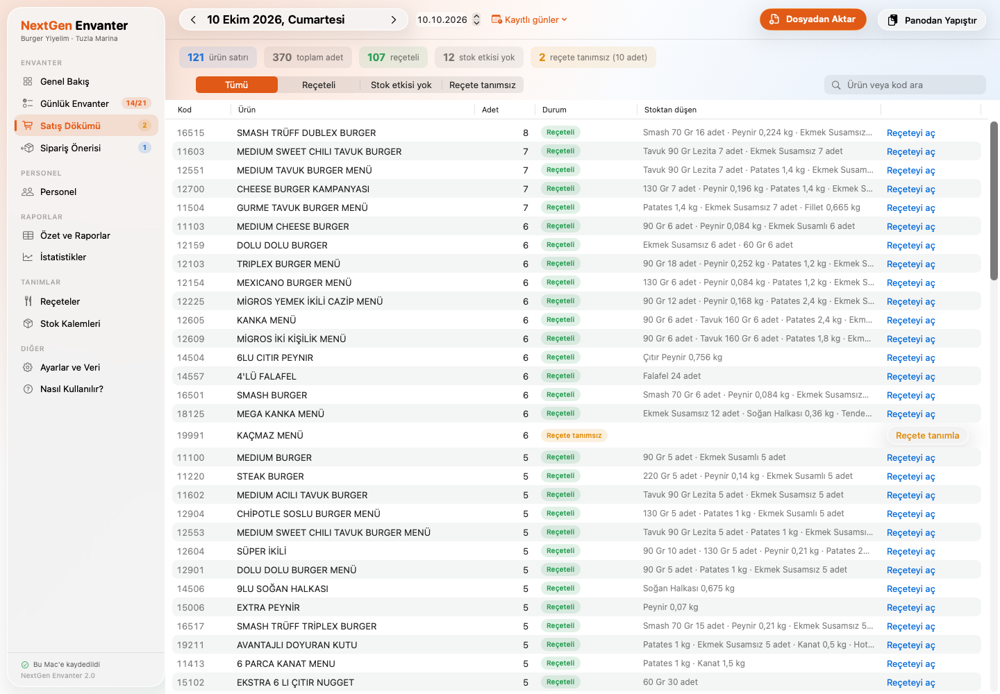 **Satış Dökümü** |
| 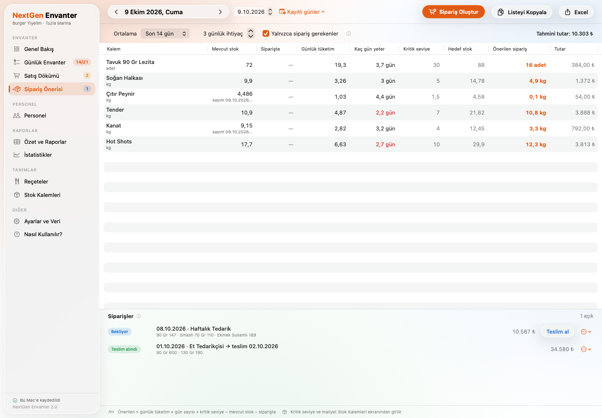 **Sipariş Önerisi ve Siparişler** | 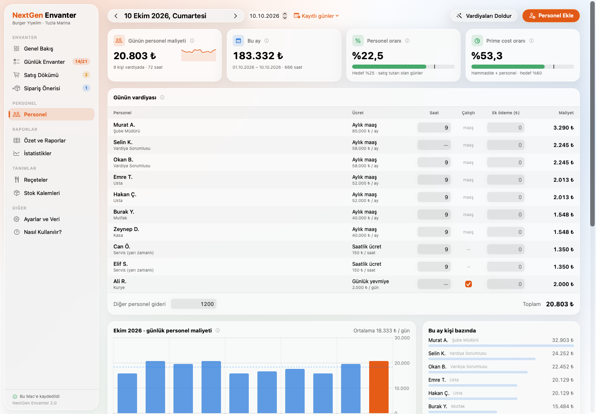 **Personel** |
| 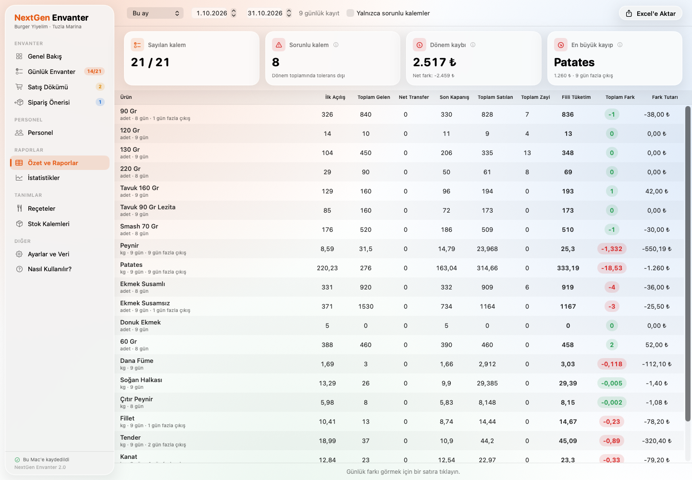 **Özet ve Raporlar** | 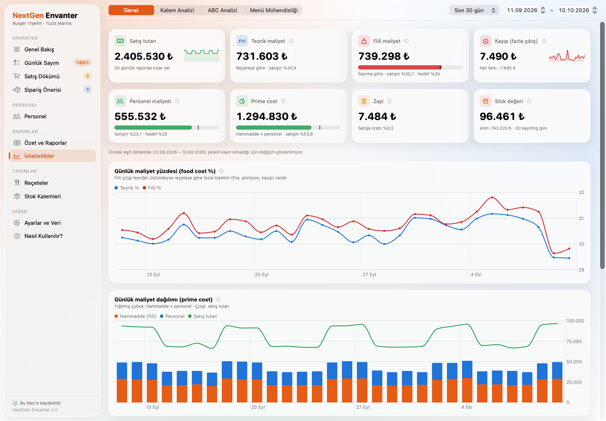 **İstatistikler · Genel** |
| 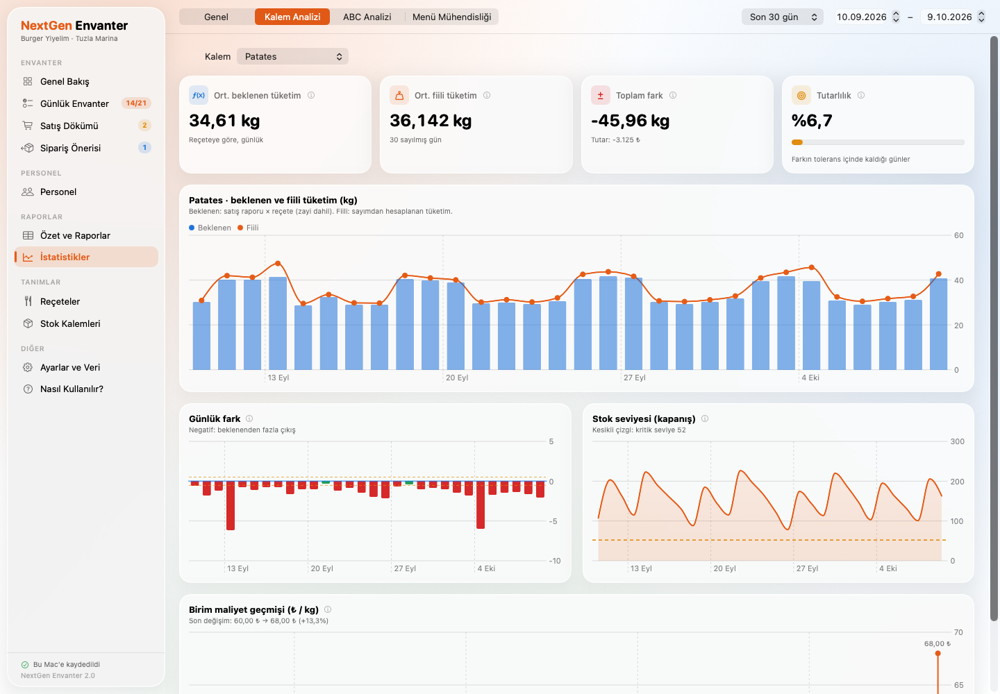 **İstatistikler · Kalem Analizi** | 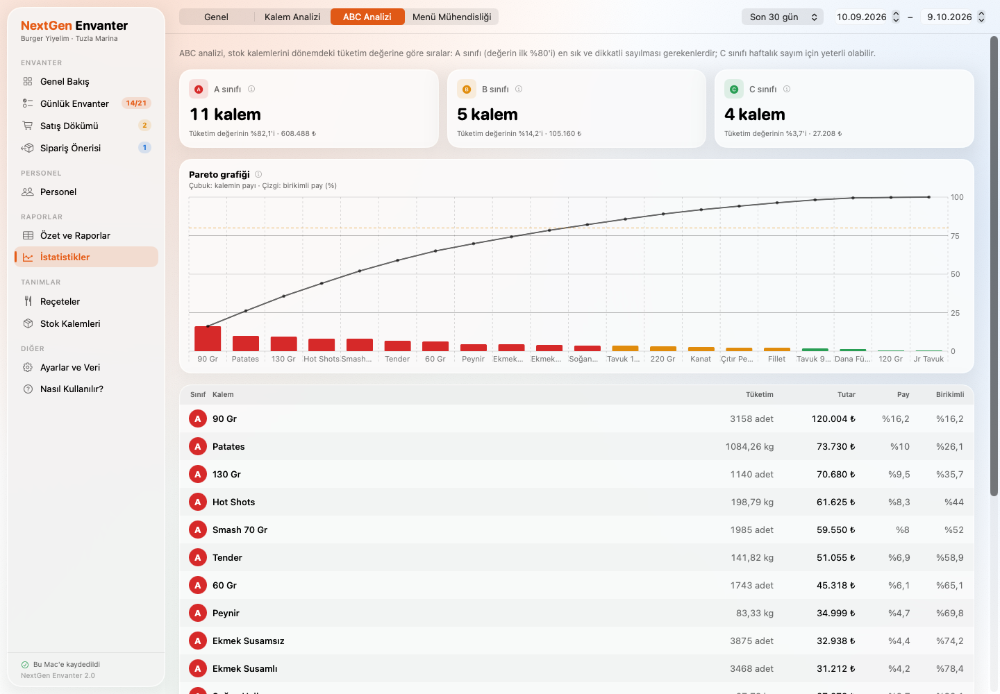 **İstatistikler · ABC Analizi** |
| 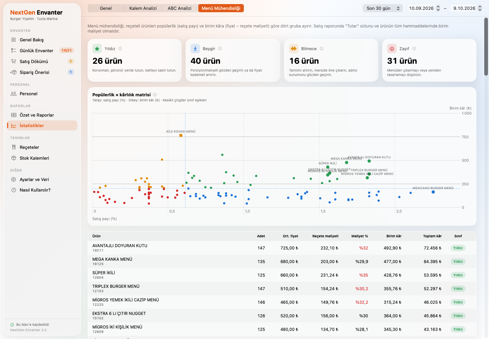 **İstatistikler · Menü Mühendisliği** | 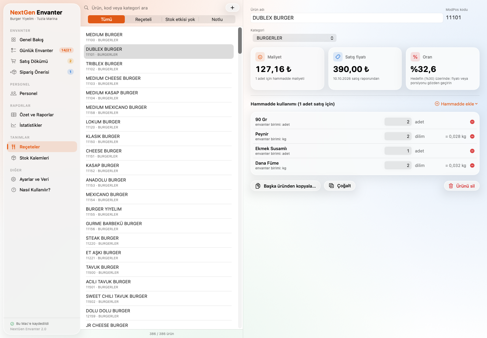 **Reçeteler** |
| 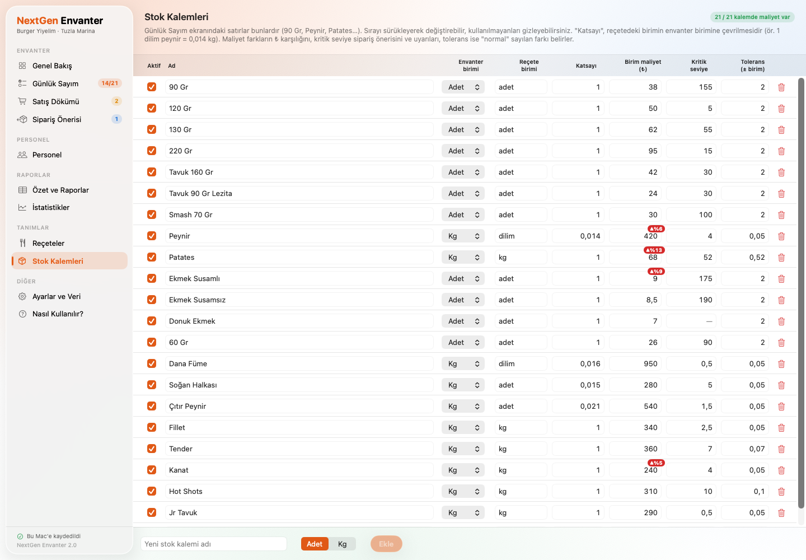 **Stok Kalemleri** | 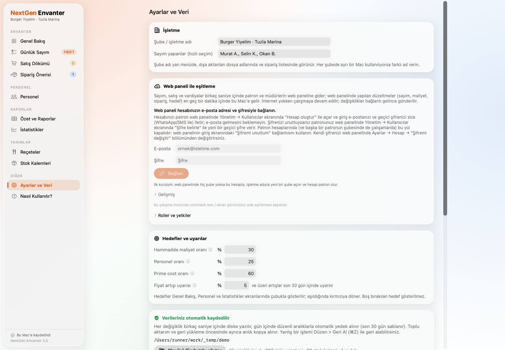 **Ayarlar ve Veri** |
| 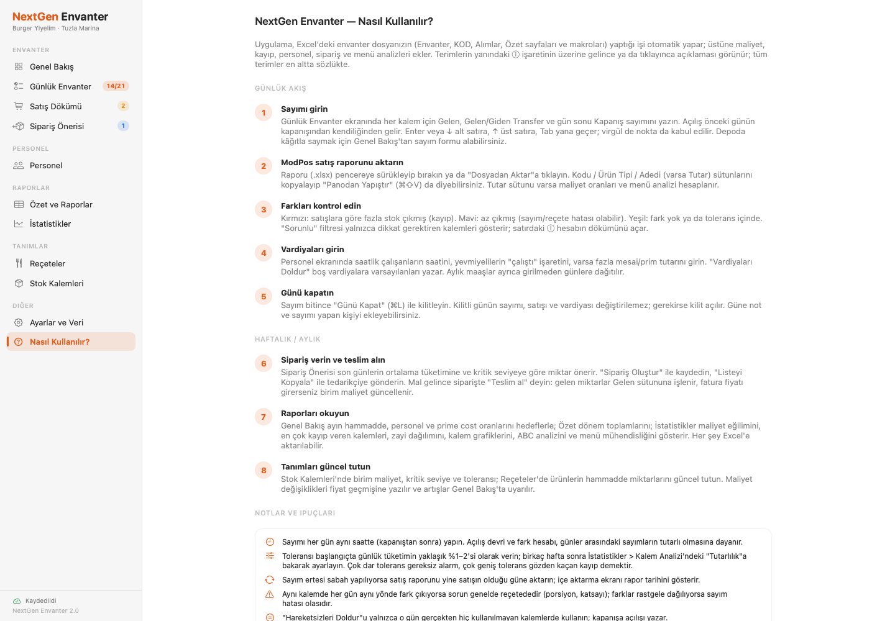 **Nasıl Kullanılır?** | |

## Kurulum (şirket içi)

1. Bir Mac'te (macOS 14+, Xcode 15+ veya Swift 5.9+ araç zinciri) derleyin:
   ```bash
   ./Scripts/build_app.sh          # build/NextGen Envanter.app + build/NextGen-Envanter-2.0.zip
   ./Scripts/build_app.sh --dmg    # ayrıca .dmg
   ```
   Hazır paket, GitHub Actions'taki her başarılı çalışmanın **NextGen-Envanter** artifact'ında da bulunur.
2. `.zip`'i diğer Mac'lere kopyalayın, `NextGen Envanter.app`'i *Uygulamalar* klasörüne taşıyın.
3. Uygulama ad-hoc imzalıdır. İlk açılışta macOS uyarı verirse Finder'da uygulamaya sağ tıklayıp **Aç** deyin ya da:
   ```bash
   xattr -dr com.apple.quarantine "/Applications/NextGen Envanter.app"
   ```

Veriler `~/Library/Application Support/Envanter/` altında tutulur (`envanter-verisi.json` ve `Yedekler/`). Uygulamayı silmek veya güncellemek verilere dokunmaz. Başka bir klasör kullanmak için `ENVANTER_DATA_DIR` ortam değişkeni verilebilir. Eski sürümlerin veri dosyası olduğu gibi açılır; yeni alanlar (personel, siparişler, hedefler, fiyat geçmişi) boş başlar.

## Komut satırı aracı

Paketin içinde `Contents/MacOS/EnvanterTool` olarak gelir (uygulama kapalıyken kullanın):

```bash
EnvanterTool status                                      # veri özeti
EnvanterTool import-excel 01.08.xlsm [--overwrite] [--dry-run]
EnvanterTool export-excel rapor.xlsx [--from 01.08.2026] [--to 31.08.2026]
EnvanterTool orders [--date 09.10.2026] [--days 14] [--cover 3]   # sipariş listesi (metin)
EnvanterTool report [--from 01.08.2026] [--to 31.08.2026]         # satış, food cost %, personel %, prime cost
EnvanterTool demo --data-dir ~/Desktop/demo [--days 35]           # eğitim için örnek veri
```

Demo veriyle uygulamayı açmak (gerçek veriye dokunmaz):

```bash
ENVANTER_DATA_DIR=~/Desktop/demo "/Applications/NextGen Envanter.app/Contents/MacOS/Envanter"
```

## Hesaplama

- **Fiili Tüketim** = Açılış + Gelen + Gelen Transfer − (Giden Transfer + Kapanış)
- **Fark** = (Satılan + Zayi) − Fiili Tüketim. Negatif fark, satışlara göre fazla stok çıktığını (kayıp) gösterir.
- **Teorik maliyet** = reçeteye göre tüketim × birim maliyet; **fiili maliyet** = teorik maliyet − sayılan kalemlerdeki net farkın tutarı. Her gün **o gün geçerli birim maliyetle** değerlenir (sonradan gelen zam kapanmış ayları değiştirmez).
- **Kayıp** = tolerans dışı fazla çıkış olan günlerin tutarı (az çıkışlarla mahsup edilmez); tüm ekranlarda aynı tanım
- **Food cost %** = fiili maliyet / satış tutarı
- **Personel maliyeti (günlük):**
  - *Aylık maaş:* maaş × çarpan ÷ ayın gün sayısı. Çalıştığı her takvim gününe yazılır (izin günleri dahil, maaş zaten ödenir).
  - *Yevmiye:* "çalıştı" işaretli ya da saat girilmiş günlerde yevmiye × çarpan.
  - *Saatlik:* saat × ücret × çarpan.
  - Bunlara ek ödemeler × çarpan ve günün diğer personel giderleri eklenir.
  - *İşveren çarpanı*, maaşın üzerine işverenin ödediği SGK primi vb. için kullanılır (ör. 1,2).
  - Ücret değişiklikleri tarihlidir: her gün o gün geçerli ücretle hesaplanır.
- **Personel %** = personel maliyeti / satış tutarı. Satış tutarı girilmiş günler ile kaydı hiç olmayan (kapalı) günlerin maaşı sayılır; personel kaydı yoksa oran "—" gösterilir.
- **Prime cost** = fiili maliyet + personel maliyeti; **prime cost %** = prime cost / satış tutarı
- **Sipariş önerisi** = ortalama günlük tüketim × gün + kritik seviye − mevcut stok (son sayım + sonraki hareketler) − siparişte bekleyen (adet yukarı tam sayıya, kg 0,1'e yuvarlanır)
- **Fiyat artışı uyarısı:** bir kalemin birim maliyeti son 30 gün içinde (birden çok değişiklik olsa da toplamda) ayarlardaki eşik (varsayılan %5) kadar veya daha fazla arttıysa
- **ABC**: tüketim değerinin ilk %80'i A, sonraki %15'i B, kalanı C
- **Menü mühendisliği** (Kasavana & Smith): popülerlik eşiği beklenen payın %70'i, kârlılık eşiği ağırlıklı ortalama birim kâr

## Geliştirme

```
Sources/EnvanterCore   Platformdan bağımsız iş mantığı (motor, istatistik, personel, satın alma, Excel/ZIP okuma-yazma, kayıt)
Sources/Envanter       SwiftUI uygulaması (yalnızca macOS; Glass.swift: Liquid Glass yüzeyleri)
Sources/EnvanterTool   Komut satırı aracı
Tests/EnvanterCoreTests
Scripts/               build_app.sh (paket), make_icon.swift (ikon), e2e_cli.sh (komut satırı uçtan uca testi)
```

```bash
swift test                                  # macOS veya Linux (çekirdek testleri)
swift build                                 # macOS'ta uygulama dahil
./Scripts/e2e_cli.sh .build/debug/EnvanterTool
ENVANTER_SELFTEST=1 ".build/debug/Envanter" # uygulama içi sistem testi (geçici klasörde, çıkış kodu 0 = başarılı)
```

CI (`.github/workflows/ci.yml`) şu adımları çalıştırır:
- **Linux:** çekirdek testleri ve komut satırı uçtan uca testi.
- **macOS:** uygulamanın derlenmesi, testler, dağıtım paketi, komut satırı testi ve **uygulama içi sistem testi**. Sistem testi; sayım, satış aktarımı, geri al/yinele, maliyet ve fiyat geçmişi, tolerans, gün kilidi, personel maliyeti, sipariş teslim alma, Excel ve diske kaydı gerçek uygulama durumu üzerinden doğrular.
- **Ekran görüntüleri:** demo veriyle macOS'ta otomatik alınır.

## Yol haritası / öneriler

- **Çok şubeli kullanım:** Her şubenin verisini merkezde birleştiren bir şube karşılaştırma ekranı (ör. ortak bir sunucu ya da paylaşılan klasöre günlük JSON aktarımı).
- **ModPos entegrasyonu:** Raporu elle almak yerine ModPos'un dışa aktarım klasörünü izleyip her sabah otomatik içe aktarma.
- **Fatura okuma:** Tedarikçi faturasının fotoğrafından/PDF'inden kalem ve fiyatları okuyup siparişi otomatik teslim alma (MarketMan, Restaurant365 gibi ürünlerde var).
- **Vardiya planlama ve POS saatleri:** Personel ekranına haftalık vardiya planı ve satış saatlerine göre "saat başına satış" (SPLH) göstergesi.
- **iPad / iPhone ile sayım:** Depoda telefonla (barkod/QR ile) sayım yapıp Mac'e aktarma.
- **Yetkilendirme:** Gün kilidini yalnızca yöneticinin açabilmesi için basit PIN; kim neyi değiştirdi kaydı (denetim günlüğü).
- **Bildirimler:** Kritik seviyenin altına düşen kalemler, fiyat artışları ve yüksek kayıp günleri için günlük e-posta/WhatsApp özeti. `EnvanterTool report` ve `orders` bugün de bir cron/launchd göreviyle kullanılabilir.
- **Yarı mamul reçeteleri:** Soslar ve hazırlıklar için alt reçeteler (reçete içinde reçete).
- **Kod imzalama:** Şirket bir Apple Developer hesabı alırsa uygulama Developer ID ile imzalanıp noter onayından (notarization) geçirilebilir. Böylece Gatekeeper uyarısı tamamen kalkar.
